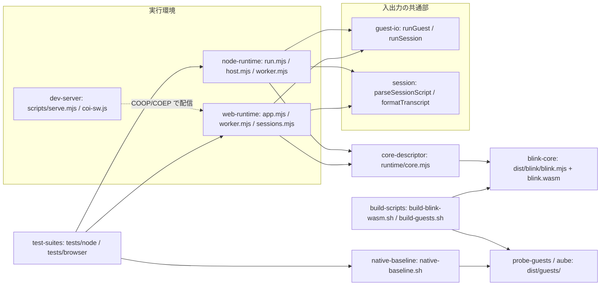
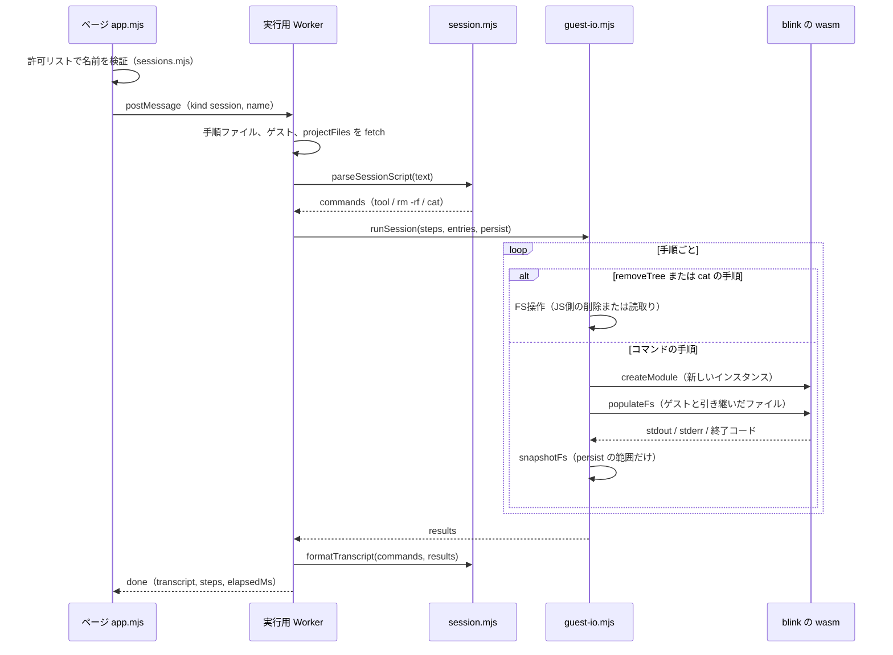
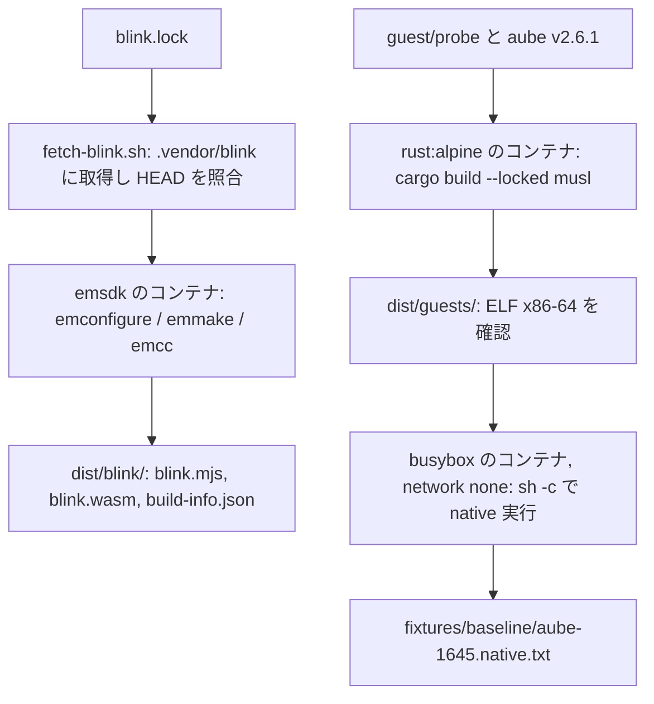

# Architecture

> 範囲と証拠：旧資料はUNVERIFIED。SOURCE_CHANGED拒否後の新snapshotとdeveloper再スキャンから統合した。今回のソース観測だけを再確認済みとして扱い、範囲外の旧記述は背景資料（未検証）として保持する。reverse-engineering-timestamp.mdを参照。

## System Overview

formicarium は 1 つのリポジトリにまとまった、ライブラリ＋実行環境の小さなモジュラーモノリスである。中心は「コア（blink の wasm）」と、それを包む入出力の共通部（`runtime/guest-io.mjs`、`runtime/session.mjs`）で、その上に Node.js 用とブラウザ用の薄い実行環境が乗る。ビルドと基準値の作成はコンテナで行う bash スクリプトが担う。サーバーやデータベースはなく、状態はすべて 1 回の実行の中の仮想ファイルシステム（MEMFS）にある。

## Architectural Style

- **層状のモジュラーモノリス（ライブラリ型）**：依存は「実行環境 → 入出力の共通部 → コアの記述子 → コア」の一方向（`docs/architecture.md` の「層と依存の向き」表、各ファイルの import で確認。検証済み（読み取り））
- **Port/Adapter 的なコア境界**：コアは「wasm 1 つ＋MODULARIZE 形式の起動用 JS」として扱い、場所と argv の組み立ては `runtime/core.mjs` の `blinkCore` 記述子だけが知る（ADR 0003）
- **手順ごとに新しいインスタンス**：状態は `persist` のディレクトリを写し取って次のインスタンスに置き直すことで引き継ぐ（ADR 0008）

## Component Relationships

テキストでの説明：Node.js の実行環境（CLI と `worker_threads`）とブラウザの実行環境（ページと実行用 Worker）は、どちらも `guest-io` と `session` を使い、コアの場所は `core-descriptor` から得る。`core-descriptor` は `dist/blink/` のビルド物を指す。`build-scripts` がコアとゲストを `dist/` に作り、`native-baseline` が `dist/guests/aube` を native に実行して基準値を作る。`dev-server` はブラウザ版を COOP/COEP 付きで配信する。テストは両方の実行環境と基準値を使う。

## Interaction Diagrams

ブラウザでの手順（session）の実行（`runtime/web/app.mjs`・`runtime/web/worker.mjs` で確認。検証済み（読み取り））。Node.js では、呼び出し側（例：`tests/node/aube-1645.test.mjs`）が `parseSessionScript`／`toSessionSteps` で steps を作り、`runtime/node/host.mjs` の `runInWorker` が `worker_threads` の Worker で同じ `runSession` を動かす。

テキストでの説明：ページが名前を許可リストで確かめ、Worker に手順の名前を送る。Worker は手順ファイル・ゲスト・入力のファイルを取得して手順ファイルを解釈し、`runSession` が手順ごとに新しい blink のインスタンスを作って、引き継いだファイルを置き、1 コマンドを実行し、`persist` の範囲（`runSession` の既定は cwd と HOME、ブラウザの手順では `[projectRoot, '/root']`）を写し取る。`rm -rf` は JS の側で行う。最後に書き起こしを作ってページに返す。比較は呼び出し側（テスト）が `normalizeTranscript` で行う。

ビルドと基準値の作成：

テキストでの説明：`blink.lock` のコミットを取得してコンテナでコアを wasm にする。ゲストは `rust:alpine` で static-musl にビルドし、ELF の種類を確かめる。基準値は busybox のコンテナでネットワークなしに native で実行して作る。

## Data Flow

入力（ゲストのバイナリ、手順ファイル、プロジェクトのファイル）→ Node.js では `copyIn`（`readHostTree`）、ブラウザでは `SESSIONS[].projectFiles` を `fetch` → MEMFS に配置 → blink が実行 → stdout はバイトまたはテキストで Worker のメッセージとして返る → 書き起こし（stderr は含めない）→ 基準値との比較。手順の間で引き継がれるのは `persist` のディレクトリのファイルの中身と `mode` だけ（詳細は `code-quality-assessment.md`）。

## Key Design Decisions

ADR は `docs/decisions/` に 12 件ある（見出しのみ確認）。この PoC の構造を決めている主なもの：

- ADR 0001：jart/blink の fork を使う
- ADR 0002：インタプリタのみ（JIT は後回し）
- ADR 0003：コアの境界を記述子と MODULARIZE 形式に限る
- ADR 0004：ビルドはコンテナで行う
- ADR 0007：ブラウザ版のゲストにネットワークを持たせない（`socket()` は `EAFNOSUPPORT`）
- ADR 0008：手順ごとに新しいインスタンスを作る
- ADR 0009：実行用 Worker で `Atomics.waitAsync` を無効にする
- ADR 0010：wasm のメモリ上限は 1 GB

## Improvement Opportunities

- 旧aube固定/引用符/catの指摘は現行ソースで解消済み。今回の配布・Worker境界の論点は下のFocused scanの統合とcode-quality-assessment.mdを参照。
- コアとゲストに依存しない部分（`core-descriptor`、`guest-io` の `runGuest`／`runSession`）は境界がはっきりしている（ソース観測）。再利用候補である（推測・未検証）

## Focused scan の統合（2026-10-06）
検証済み（ソース観測）：Node host→core/Worker、Node Worker→guest-io/core、web Worker→core/guest-io/session/sessions、web sessions→registry、app→sessions。共通JSは Node builtin を import しない。registry がデモ/受入れのゲスト・環境・手順を所有する（runtime/registry.mjs:28–81）。Node の手順変換は呼び出し側が session を利用する。
上の Interaction Diagrams の現行補足：commands は tool / rm -rf / cat を含む。runSession は cat/removeTree を JS のFS操作として扱い、ゲスト手順は新インスタンスに配置して実行し、persist のsnapshot を次へ渡す（runtime/session.mjs:36–99、guest-io.mjs:348–384）。native-baseline は session-info からゲスト/手順/環境を得る（scripts/native-baseline.sh:49–52）。pitchfork は既存 aube でUIビルド後 musl の1行パッチを適用する（build-guests.sh:77–128）。
テキストでの現行フロー：ページ→許可リスト/registry→Worker→手順とゲスト/入力の取得→session の変換→guest-io の手順実行とFS引継ぎ→書き起こし→ページ。Node は host→Worker の入口で同じ共通部を使う。
推測・未検証：npm exports と配布資産のURL解決、汎用browser Workerの guest/fixture 注入、別run呼出しのFS状態、timeout/terminate/dispose、bytes/text結果型の公開契約が後続設計の論点。core 記述子の差替えだけではWorker選択表の更新を避けられない（node/worker.mjs:13,40–41）。これは設計決定や確定要件ではない。
ドキュメント根拠：ADR 0002/0003/0008/0009/0010 の境界を維持する。JIT提案、ゲスト再ビルド、品質上限緩和は行わない。図は旧資料から継承した。Mermaid構文検証は旧候補の4図について mermaid12.1.0 total4/failed0（親の公式parse）を観測した。今回の図が同じSHA256を持つ場合だけその結果を適用し、renderは未実施。
