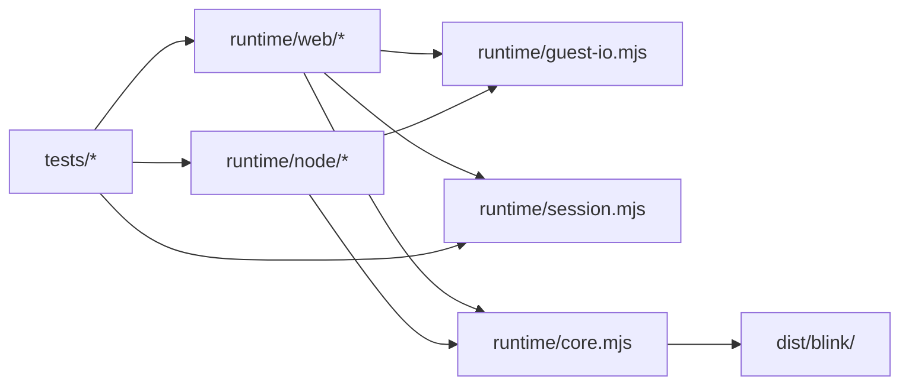

# Dependencies

> 範囲と証拠：旧資料はUNVERIFIED。SOURCE_CHANGED拒否後の新snapshotとdeveloper再スキャンから統合した。今回のソース観測だけを再確認済みとして扱い、範囲外の旧記述は背景資料（未検証）として保持する。reverse-engineering-timestamp.mdを参照。

## 外部の依存

| 依存 | 種類 | 固定の方法 | 備考 |
|---|---|---|---|
| `@playwright/test` | npm（devDependencies） | `package-lock.json` | 実行時の npm 依存はない |
| blink の fork | C ソース（ビルド時に取得） | `blink.lock` の `commit=4b5c67d5…`。`scripts/fetch-blink.sh` が HEAD を照合 | upstream は `jart/blink` @ `f006a4fc…` |
| aube | Rust ソース（ビルド時に clone） | `aubepkg/aube` v2.6.1。コミット `bd94e42f…` を `dist/guests/aube.commit` に記録 | project.md の Corrections により、ソースが変わらなければ再ビルドしない |
| probe のクレート | Rust（`libc 0.2`、`rayon 1`、`tokio 1`） | `guest/probe/Cargo.lock`、`--locked` | |
| コンテナのイメージ | `rust:alpine`、`emscripten/emsdk:<版>`、`busybox:latest` | タグのみ（ダイジェストでは固定していない） | 環境変数 `FORMICARIUM_RUST_IMAGE`、`FORMICARIUM_NATIVE_IMAGE` で差し替えられる |
| 名前付きボリューム | `formicarium-cargo-registry`、`formicarium-cache` | — | ビルドのキャッシュ |

## 内部の依存

テキストでの説明：ブラウザの実行環境は `guest-io`、`session`、`core` に依存する。Node.js の実行環境は `guest-io` と `core` に依存し、手順の解釈は呼び出し側（テスト）が `session` で行う。テストはブラウザ側の `sessions.mjs` の一覧も読む（`tests/node/runner.test.mjs` が `projectFiles` と `fixtures/` の一致を確かめる）。循環は見当たらない（developer のスキャンによる。検証済み（読み取り））。

## ビルド物への依存

- `dist/blink/blink.{mjs,wasm}`、`dist/guests/*`、`fixtures/baseline/aube-1645.native.txt` がないと、テストは `missingArtifacts()` で理由を示して失敗する
- `dist/` と `.vendor/` は gitignore の対象。`fixtures/baseline/aube-1645.native.txt` は gitignore に書かれているが、リポジトリには登録されている（`git ls-files` で確認）

## 現行の依存境界（2026-10-06）
検証済み（ソース観測）：web/sessions→registry、scripts/session-info→registry、native-baseline→session-info。共通JSにNode builtin依存はない。pitchfork v2.29.0 のビルドは既存aube・Node24によるUIビルドと承認済みmusl ioctl 1行パッチに依存し、build-infoにパッチsha256/UI node版を記録する（build-guests.sh:77–128）。
旧Gitコマンド観測は当時の証拠であり今回再実行していない。リポジトリ操作はAGENTS.mdに従いjjを使う。
ドキュメント根拠：docs/licenses.md:29–30 は配布時のISCとEmscripten/musl表示同梱を記載する。build-blink-wasm.sh:132–149 にはライセンス生成・コピー工程がない（ソース観測）。法律上の評価を追加していない。
推測・未検証：npm packのallowlist、blink loader/wasm/pthreadのURL配置とprovenance、third-party noticesの受入れ確認が後続設計事項。guest/fixtureの配布先はintentでterrariumとされるがterrariumの実装は未検証。
