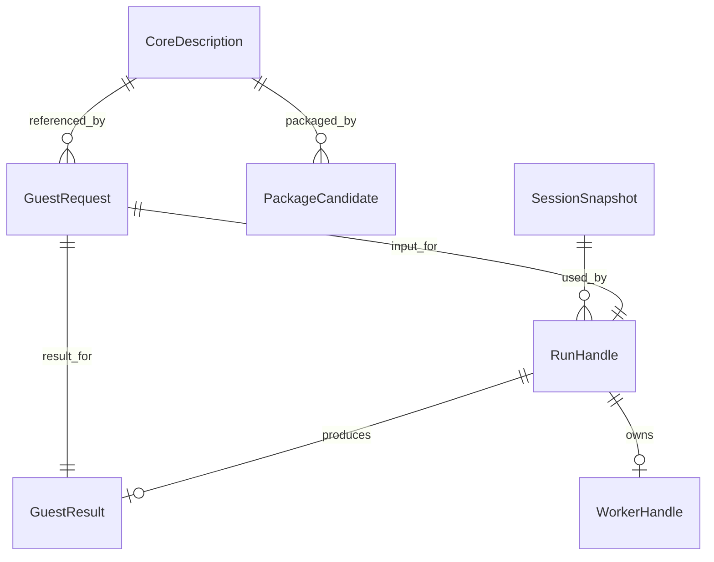

# Functional Specification — u1-runtime-package

## Sources

ドキュメント根拠：requirements.md FR1–FR4/FR7/NFR1–NFR7、unit-of-work.md U1、unit-of-work-story-map.md、stories.mdのU1担当9ストーリー、components.md、contract-summary.md C1/C2/C8。Q1は「不足する親を自動作成」（人間の原文：1）。技術設計は以下の提案であり、実装・pack・guest・browserの成功は未検証。

初回設計時のソース観測：runtime/core.mjsはloader/build-info/argvを所有する。当時のguest-io.mjsではhard-linkとFS参照時点に不足があった。現候補では両者を修正済みであり、初回観測を現候補の欠陥とは扱わない。今回のソース読取りでは、loader照合後の別取得と、削除したnested cwdの不足親の再作成が未対応である。実行再現は未検証。

## Revision — R-01 and R-02

人間のRequest Changesおよび「上記2件」を根拠に、既存C1/C2の履行を明確化する。新しい公開APIや品質基準の変更は行わない。

- R-01：取得・照合したloader bytesをそのまま評価対象へ結合する。元のURLをもう一度取得して評価する手順を成功経路に残さない。pthread等の補助実行環境も同じ照合済みloaderを使用し、未照合の再取得を許可しない。loader/wasm/build-infoの同一tuple、同一originのWorker、隔離、CORS、CSPの条件を維持する。条件を満たせない場合はguest開始を拒否し、任意のURLやpolicy迂回を成功扱いにしない。具体的な取得・評価方式と資源の寿命は後続のNFR/Infrastructure Designで定義する。
- R-02：setCwdで指定したnested dirの祖先をremoveした場合、次runの復元でroot境界内の不足親からcwdまで順に作成する。再作成dirのmodeは0755、存在するdirの明示mode・seed・inode/linkを保持する。中間file/symlinkの衝突を黙って上書きせず、異常時は既存のrollbackとcleanupを適用する。remove自体や不存在listEntriesの意味は変更しない。成功snapshotに再作成dirを含め、異常runでは所有stateを変更しない。

修正の受入れでは、照合後に元URLのloader応答を変更するoracleと、nested cwd設定→祖先削除→次runの公開操作列を追加する。単体の偽FSは親の存在条件を実FSと同様に検査する。空consumerのNodeと3ブラウザで実coreを確認し、修正前の失敗と修正後の成功をmain sessionが順番に観測する。新候補をpackし、その候補のdigestに結合した証拠とcoverageを取り直す。前候補v4の成功を修正後の証拠として流用しない。

## Scope and Ownership

CoreAdapter、GuestExecution、SessionState、ExecutionLifecycle、PackageSupplyの5責任をU1内で実装する。SessionStateだけが次runへ渡す状態を所有する。既存CLI/registry/session手順DSLは開発・受入れ側へ残し、製品のguest登録要件にしない。U2のguest配布、U3の既存表示、U4のcoverage集計・公開判断はここへ移さない。

## Entity Relationship View

entities.mdのデータモデルの派生表示（正本は同ファイルのYAML）。

| 参照元 | 参照先 | 多重度・意味 |
|---|---|---|
| RunHandle | SessionSnapshot | 多対1、受付世代の状態 |
| RunHandle | GuestRequest / GuestResult | 1対1 / 1対0..1 |
| RunHandle | WorkerHandle | 1対0..1、入力拒否では未生成 |
| GuestRequest | CoreDescription | 多対1 |
| PackageCandidate | CoreDescription | 多対1、同梱コア情報 |

テキスト代替：sessionの各runは入力とWorkerを持ち、完全な結果が得られたときだけ所有snapshotを置換する。候補はコアの供給物情報を参照する。

## Session Creation Workflow

1. optionsの形状、cwd/homeの絶対POSIXパス、禁止root、entries全件とAssetsを検証する。入力とbytesをコピーし、consumerの変更やtransferによるdetachを受けない。
2. persist rootsは初期cwd/homeで固定する。重なるrootは外側1つへ統合する。初期cwd/homeを作成し、親が未指定のseedも0755で補う（Q1）。明示dirのmodeを最後に適用し、entries順による結果差を作らない。
3. 正規化pathの重複、file/symlinkを途中親に持つentry、root外symlink target、inodeグループのdata/mode不一致は全体をINVALID_INPUTとして拒否する。予約領域との衝突も拒否する。
4. 初期seedとcurrent stateを独立コピーで保存し、idle sessionを返す。guest/coreの起動はrunまで行わない。環境/資産の実取得確認はrun開始時に行い、期限の対象とする。

## Run Workflow

1. disposedならDISPOSED、active runならBUSYを先に判定する。guestは非空のELF64/little-endian/x86-64 executableとしてヘッダ・program-header範囲を検証し、PT_INTERPを拒否する。static-muslの出自はヘッダだけでは証明できない。対応範囲はstatic-musl x86-64、非対応syscallは通常guest失敗またはEXECUTIONとして区別する。
2. args/env/guestをコピーし、文字列型とNUL、env名、HOME不一致、正の有限整数timeoutを検査する。signalがabort済みならABORTED、Workerは生成しない。既定timeoutは600000ms。
3. idle→preparingを同期的に予約してrunId/generationを固定し、受付時刻と絶対deadlineを記録する。開始後はreadFile/remove/listEntries/setCwd/resetをBUSYで拒否する。
4. Node/browser adapterがWorkerを作り、C8 protocolVersion=1のrun requestを送る。Node builtinをbrowser/sharedへ持ち込まない。browserの必須Worker/SharedArrayBuffer/隔離条件不足はUNSUPPORTED_ENV。loader/wasm/build-info不足はASSET_LOAD。未知または混在ビルドを拒否する。
5. Workerはbrowserでdelete Atomics.waitAsyncをコアロード前に行う。コア固有URL/argv/loader factory/補助Worker資産の設定はruntime/core.mjsの記述子へ閉じる。GuestExecutionは一般FS操作と入出力のadapter契約だけを扱う。
6. Workerは新しいcoreへコピーしたstateを配置し、hard-linkグループの代表fileを先に作って残りをlinkする。dir→file/link→symlinkの順で復元し、明示dir modeを最後に適用する。guestは/guestへ配置、cwdが削除されていればrun用作業dirを作成する。HOMEはsession.home。
7. preparing→running。stdout/stderrはbytesで収集し、flushされたchunkに全stream共通sequenceを与える。stdout/stderrのbufferを独立維持し、未flush chunk間のbyte単位interleavingを新たに保証しない。hostは受信順にコピーをcallbackへ渡し、その戻り値を待たない。callback throwはEXECUTION、rollback、Worker終了。
8. 正常onExit（非0も含む）でrunning→snapshotting。FS参照はfactory Promise完了に依存せず、実行前の初期化hookで確保する。先に全outputをflushし、lstatによりroot内を走査する。symlinkをfollowしない。同一inodeのfileは同じinodeIdを持つ。欠落rootは削除された状態として扱い、重複rootを二重列挙しない。未知特殊fileは黙って落とさずSNAPSHOTで全体を拒否する。
9. C8 doneをhostが全件検証する。中間親の矛盾、root外entry、symlink escape、inode不一致、不正mode/bytes、出力集約の不一致はSNAPSHOT/EXECUTIONで拒否する。ゲストが生成したroot外symlinkもrollback対象。原子的commit後にresultをresolveする。snapshot復元時は欠落cwdを作成できるが公開listEntriesは不存在をNOT_FOUNDとする。
10. terminatingへ進みtimer/listener/取得処理を解除しWorkerを終了する。cleanup完了までactive予約を維持する。正常/異常のPromiseは一度だけsettleし、sessionはidleへ戻る。dispose要求ならstateを破棄しdisposedへ進む。

## Termination and Message Arbitration

hostのterminal decisionは一つ。各messageを処理する前にもdeadlineとsignalを確認し、期限後のdoneはcommitしない。disposeはsessionを不可逆に閉じ、active runをABORTEDとして終了する。timeout/abort/dispose/worker error/messageerror/core失敗/通知欠落はrollbackし、partial bytesは既にhostに届いた分のみを返す。異常時に自動再実行しない。

同じsessionId/runId/generation/protocolVersionのmessageだけを採用する。古いrunと既にsettledの終端は無視する。現在runの未知type/形状不正/sequence逆転はEXECUTIONとして終了。doneの重複やterminate由来exitが成功を上書きしない。callbackが同期的にdisposeを呼んだ場合も、その後のdoneはcommitしない。

Node terminateの完了を待つ。browser terminateは同期APIとして実行し参照とlistenerを切る。nested pthread Workerの終了はcore adapterのcleanupに含め、実試験で確認する。終了失敗は正常終了へ変換しない。新runに古いWorkerを再利用しない。

## Public File Workflows

すべてSessionStateで処理し、guestを起動しない。状態検査→正規化とroot境界検査→中間symlink拒否→対象判定→コピー/原子的変更の順。

- readFile：通常fileのみコピーを返す。不在NOT_FOUND、dir/symlinkはNOT_FILE。
- remove：root自身はINVALID_INPUT。file/symlinkはそのentryだけ、dirは全子孫を原子的に削除。不在は冪等成功。他hard-linkのinode内容は維持する。
- listEntries：省略時cwd、dirの直下のみ絶対pathのcode-unit昇順。file/symlinkは[]、不在NOT_FOUND。返却dataはコピー。
- setCwd：root内の存在するdirだけへ移動。不在NOT_FOUND、file/symlinkはNOT_FILE。persist rootsを変更しない。
- reset：初期seed/cwd/homeへ一括復帰。別sessionへ影響しない。
- dispose：冪等。active run終了とstate破棄の完了を待つ。以後DISPOSED。

## State Machine

| 現在 | Trigger | 次状態 | state commit |
|---|---|---|---|
| idle | valid run | preparing | なし |
| preparing | core開始 | running | なし |
| running | 正常exit | snapshotting | まだなし |
| snapshotting | valid done、期限内、未abort | terminating | 全snapshotを一度 |
| preparing/running/snapshotting | error/timeout/abort/dispose | terminating | なし |
| terminating | cleanup完了 | idleまたはdisposed | dispose時破棄 |
| idle | dispose | disposed | 破棄 |
| disposed | dispose | disposed | なし |

FS操作はidleのみ。active中の追加runはBUSY。終端の後にgenerationが合う通知でも採用しない。

## Package Layout and Fixed Inventory

以下は実装時の固定配置案。新しい候補内容を変更するときはpack一覧とcoverage一覧を同時に更新して差分をレビューする。閾値達成のために除外しない。

| export key | tarball target | 宣言 |
|---|---|---|
| . | runtime/public.mjs | types/index.d.ts |
| ./node | runtime/node/api.mjs | types/node.d.ts |
| ./browser | runtime/web/api.mjs | types/browser.d.ts |
| ./assets/blink.mjs | assets/blink.mjs | なし |
| ./assets/blink.wasm | assets/blink.wasm | なし |
| ./assets/build-info.json | assets/build-info.json | なし |

第一者配布JSの固定一覧：runtime/public.mjs、runtime/errors.mjs、runtime/validation.mjs、runtime/state.mjs、runtime/lifecycle.mjs、runtime/protocol.mjs、runtime/worker-execution.mjs、runtime/core.mjs、runtime/guest-io.mjs、runtime/node/api.mjs、runtime/node/package-worker.mjs、runtime/web/api.mjs、runtime/web/package-worker.mjs。public rootはdecodeUtf8と公開エラー型/クラスのみ、createSessionは環境別入口に置く。内部FS/helper/Worker protocolをpublic exportsへ昇格しない。

Node/browser apiは自身に相対のpackage-worker.mjsとpackage内assetsを既定URLにする。browserの明示Assetsはbundler再配置の手段。Nodeはfile URLの取得をadapterに限定する。core.mjsの製品向け記述子はassets配置を知り、既存PoCのdist向け記述子と区別する。repo root探索をしない。generated loaderのpthread補助を同梱loader自身が提供するか追加資産が必要かはbuild成果物で検査し、必要なら固定一覧を根拠付きで改訂する。欠落したまま完成扱いしない。

同梱非JS：types/index.d.ts、types/node.d.ts、types/browser.d.ts、assets/blink.mjs、assets/blink.wasm、assets/build-info.json、LICENSE、THIRD_PARTY_NOTICES.md、README.md、package.json。core loaderは第三者生成物のため第一者coverageから除外し、digest/実ロードを別検証する。宣言・license/noticeは資産/型の別チェック。guest ELF/fixtures、tests、開発CLI/registry/session/web page/service worker、aidlc/private記録、vendorソースはpackへ含めず、coverage分母からの除外理由をU4へ渡す。

PackageCandidateはtarball digest、固定配布JSと各digest、assets/notice/build-info digest、version、blink.lock commitとdirty=falseを保持する。U1は実packと空consumer検証を提供し、U4が最終品質/公開証拠へ対応付ける。

## Acceptance Scenarios and Handoff

traceability.jsonの28ACを全件対象にする。空consumerのNode/3browser、欠落資産、隔離不足、型の正誤、非UTF-8/stream分離、registry未登録guest/exit3、不正ELF/path、timeout/abort/古いmessage、BUSY/disposed、callback throw、snapshot失敗rollback、hard-link/symlink/mode、削除/reset/独立sessionを固定fixtureで検証する。Q1には親不足の自動生成、明示modeと入力順不変、親file/symlink衝突拒否を追加する。

U1だけでtarballの最小統合版を検証できるようにする。pitchfork/aubeの実手順の全体証拠、80%coverageの収集成功、統合前CI、RC/stable公開はU4、実terrarium連携はU3で別に確認する。U1担当stateの動作はU4まで未実施のまま隠さない。検証コマンドは実装後に具体的な内容を示して既定手順で選定する。

## Rules Summary

BR1.1–BR1.3はpack・資産・型/供給物、BR2.1–BR2.4は入力・bytes・エラー・終了、BR3.1–BR3.3は状態・FS・分離、BR4.1–BR4.2はcore境界・browser回帰、BR5.1は今回回答した初期親自動生成。正本はrules.md。

## Assumptions & Open Questions

未回答の製品判断なし。実装成功は未検証。coreのFS参照時点、nested pthread終了、hard-link復元、特殊file拒否、全環境の資産ロードは後続の実試験で確認する。guest networkの拒否とdaemonの有限終了は固定fixtureで確認し、一般ELFだけからdaemonを推定して拒否する新APIは作らない。実機Safariは既存方針どおり未検証。mtime忠実再現、ページ再読込み永続化、paludarium/JIT/新guest/汎用shellは追加しない。
