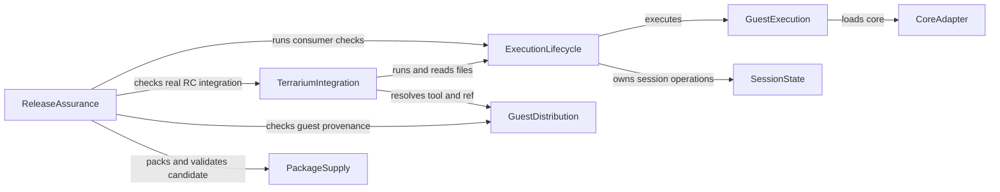

# Domain Components

## Sources

- [memory:M1] 承認済みrequirements.md/stories.md：全機能・品質と18ストーリー。
- [memory:M2] CodeKB architecture.md/component-inventory.md/dependencies.md：既存core/guest-io/session/Node/web/registry構造。旧未検証部分を動作保証にしない。
- [memory:M3] team-practices.mdと承認済みrefined-mockups。

## Component Catalogue

8つの論理境界を提案する。これはUnit/配備トポロジー/新基盤の決定ではない。新規の汎用API・Workerライフサイクル・状態所有・配布と公開判断が必要なため、本工程を実施する。既存ファイルと一対一に新モジュールを作る指示ではない。catalogueは機械読取り可能なflow-style YAML（JSON構文）で、表と図は同じデータから導く。

```yaml
{
  "components": [
    {
      "name": "CoreAdapter",
      "summary": "コア固有の場所・起動情報の境界",
      "behaviour": "runtime/core.mjsだけがコア固有知識を持つ。ビルド済みloader/wasmと取得元を記述し、guest登録やUIを所有しない。",
      "responsibilities": [
        "コア記述子と起動情報"
      ],
      "depends_on": [],
      "dependents": [
        {
          "component": "GuestExecution",
          "interaction": "loads core"
        }
      ],
      "external_dependencies": [
        {
          "name": "既存blink forkのloader/wasm/build-info",
          "kind": "other",
          "purpose": "ビルド済みコア。差替え境界を維持"
        }
      ],
      "entities": [
        {
          "name": "CoreDescription",
          "identifier": "coreId",
          "attributes": [
            "coreId",
            "loaderLocation",
            "wasmLocation",
            "sourceCommit",
            "buildInfo"
          ],
          "references": []
        }
      ]
    },
    {
      "name": "GuestExecution",
      "summary": "汎用guestの単一実行と入出力取得",
      "behaviour": "登録表を編集せずguest入力を検証・配置し、新コアインスタンスで実行する。stdout/stderr/bytes/guest終了を取得し、状態更新用の材料を返す。永続状態の所有者にはならない。",
      "responsibilities": [
        "guest入力の解釈と実行",
        "出力とFS変更材料の抽出"
      ],
      "depends_on": [
        {
          "component": "CoreAdapter",
          "interaction": "loads core",
          "style": "sync"
        }
      ],
      "dependents": [
        {
          "component": "ExecutionLifecycle",
          "interaction": "executes"
        }
      ],
      "external_dependencies": [],
      "entities": [
        {
          "name": "GuestRequest",
          "identifier": "requestId",
          "attributes": [
            "requestId",
            "guest",
            "args",
            "env",
            "cwd",
            "inputFiles",
            "coreId"
          ],
          "references": [
            {
              "entity": "CoreDescription",
              "owned_by": "CoreAdapter",
              "relationship": "実行対象コアの情報を参照"
            }
          ]
        },
        {
          "name": "GuestResult",
          "identifier": "requestId",
          "attributes": [
            "requestId",
            "stdout",
            "stderr",
            "exitCode",
            "failure",
            "fileChanges"
          ],
          "references": []
        }
      ]
    },
    {
      "name": "SessionState",
      "summary": "同一セッションのファイル状態の唯一の所有者",
      "behaviour": "作業領域/HOMEのファイル・modeと状態世代を所有する。guest更新とJS読取/削除/resetを同じ所有者で扱い、別端末へ状態を共有しない。受渡しはコピーした状態で行い、他コンポーネントから所有状態を直接変更させない。",
      "responsibilities": [
        "セッション内状態の取得・反映",
        "JS読取・削除・resetと境界検証"
      ],
      "depends_on": [],
      "dependents": [
        {
          "component": "ExecutionLifecycle",
          "interaction": "owns session operations"
        }
      ],
      "external_dependencies": [],
      "entities": [
        {
          "name": "SessionSnapshot",
          "identifier": "sessionId",
          "attributes": [
            "sessionId",
            "generation",
            "cwd",
            "home",
            "entries",
            "modes"
          ],
          "references": []
        }
      ]
    },
    {
      "name": "ExecutionLifecycle",
      "summary": "公開実行入口・環境adapter・runとWorkerの寿命",
      "behaviour": "Node/browser入口を分離して同じ実行契約へ対応させる。資産取得と入力検証、timeout/cancel/dispose、終了結果1回、遅延通知の識別、状態操作の順序を所有する。Node builtinをbrowser入口へ持ち込まない。",
      "responsibilities": [
        "Node/browser public入口と環境adapter",
        "run/Workerの開始・中止・終了",
        "SessionStateへの状態操作"
      ],
      "depends_on": [
        {
          "component": "GuestExecution",
          "interaction": "executes",
          "style": "async"
        },
        {
          "component": "SessionState",
          "interaction": "owns session operations",
          "style": "sync"
        }
      ],
      "dependents": [
        {
          "component": "TerrariumIntegration",
          "interaction": "runs and reads files"
        },
        {
          "component": "ReleaseAssurance",
          "interaction": "runs consumer checks"
        }
      ],
      "external_dependencies": [
        {
          "name": "Node worker_threads / browser Worker",
          "kind": "other",
          "purpose": "環境ごとのWorker起動と終了"
        },
        {
          "name": "consumerの資産取得環境",
          "kind": "other",
          "purpose": "host通信でloader/wasm/guest等を取得。guest networkとは別"
        }
      ],
      "entities": [
        {
          "name": "RunHandle",
          "identifier": "runId",
          "attributes": [
            "runId",
            "requestId",
            "sessionId",
            "workerId",
            "generation",
            "termination",
            "result"
          ],
          "references": [
            {
              "entity": "GuestRequest",
              "owned_by": "GuestExecution",
              "relationship": "このrunの入力"
            },
            {
              "entity": "GuestResult",
              "owned_by": "GuestExecution",
              "relationship": "このrunの結果"
            },
            {
              "entity": "SessionSnapshot",
              "owned_by": "SessionState",
              "relationship": "このrunが利用する状態"
            }
          ]
        },
        {
          "name": "WorkerHandle",
          "identifier": "workerId",
          "attributes": [
            "workerId",
            "runId",
            "environment",
            "assetLocations",
            "termination"
          ],
          "references": []
        }
      ]
    },
    {
      "name": "TerrariumIntegration",
      "summary": "既存UI/要素/run()/iframeの互換性と翻訳",
      "behaviour": "tool/ref/fixture/cwd/base、tool切替reset、transcript、code/outputとイベントを基準へ対応させる。承認済み親だけからrunを受け通知する。非対応/隔離不足の原因を伝え、未知refを別版へfallbackしない。",
      "responsibilities": [
        "既存入口・表示・通知・入力の翻訳",
        "guest/ref選択と端末操作の対応"
      ],
      "depends_on": [
        {
          "component": "ExecutionLifecycle",
          "interaction": "runs and reads files",
          "style": "async"
        },
        {
          "component": "GuestDistribution",
          "interaction": "resolves tool and ref",
          "style": "async"
        }
      ],
      "dependents": [
        {
          "component": "ReleaseAssurance",
          "interaction": "checks real RC integration"
        }
      ],
      "external_dependencies": [
        {
          "name": "既存terrariumのxterm/DOM/postMessage",
          "kind": "other",
          "purpose": "端末と親originを含む互換対象"
        }
      ],
      "entities": [
        {
          "name": "TerminalBinding",
          "identifier": "terminalId",
          "attributes": [
            "terminalId",
            "tool",
            "ref",
            "fixture",
            "cwd",
            "base",
            "sessionId",
            "queuedCommands",
            "transcript",
            "notification"
          ],
          "references": [
            {
              "entity": "SessionSnapshot",
              "owned_by": "SessionState",
              "relationship": "端末が公開操作から利用する状態"
            },
            {
              "entity": "GuestBuild",
              "owned_by": "GuestDistribution",
              "relationship": "選択したtool/refの供給物"
            },
            {
              "entity": "RunHandle",
              "owned_by": "ExecutionLifecycle",
              "relationship": "端末から開始したrun"
            }
          ]
        }
      ]
    },
    {
      "name": "GuestDistribution",
      "summary": "terrariumのtool/ref別guestとfixtureの配布・解決",
      "behaviour": "aube/pitchforkのstatic-musl guest、fixture、builds一覧、取得元commitの対応を所有する。branch/tag/commit/pr-番号を既存形式で解決し、欠落は識別可能な失敗にする。",
      "responsibilities": [
        "ref別guest/fixtureのビルド・配布記述",
        "取得元と選択の対応"
      ],
      "depends_on": [],
      "dependents": [
        {
          "component": "TerrariumIntegration",
          "interaction": "resolves tool and ref"
        },
        {
          "component": "ReleaseAssurance",
          "interaction": "checks guest provenance"
        }
      ],
      "external_dependencies": [
        {
          "name": "aube/pitchfork sourceと既存ビルド環境",
          "kind": "other",
          "purpose": "対象guestの供給。変更のないaubeは再ビルドしない"
        },
        {
          "name": "terrariumの既存配布先",
          "kind": "object-store",
          "purpose": "ref別build/fixture成果物。新しい基盤は選定しない"
        }
      ],
      "entities": [
        {
          "name": "GuestBuild",
          "identifier": "buildKey",
          "attributes": [
            "buildKey",
            "tool",
            "ref",
            "sourceCommit",
            "guestLocation",
            "fixtureLocations",
            "buildInfo"
          ],
          "references": []
        }
      ]
    },
    {
      "name": "PackageSupply",
      "summary": "共通npm候補の資産・型・供給物情報",
      "behaviour": "public exports、第一者JS/Worker、loader/wasm、型、LICENSE/notices/build-infoをpack候補へ含め、外部repo参照とguest/fixture同梱を防ぐ。候補内容と版を識別できるようにする。",
      "responsibilities": [
        "共通パッケージ内容・公開資産と型",
        "候補の同一性と取得元情報"
      ],
      "depends_on": [],
      "dependents": [
        {
          "component": "ReleaseAssurance",
          "interaction": "packs and validates candidate"
        }
      ],
      "external_dependencies": [
        {
          "name": "npm packと既存コアビルド成果物",
          "kind": "other",
          "purpose": "候補作成。npm registryへの公開はReleaseAssuranceが判定"
        }
      ],
      "entities": [
        {
          "name": "PackageCandidate",
          "identifier": "candidateId",
          "attributes": [
            "candidateId",
            "version",
            "exports",
            "assets",
            "types",
            "licenses",
            "notices",
            "buildInfo",
            "contentDigest"
          ],
          "references": [
            {
              "entity": "CoreDescription",
              "owned_by": "CoreAdapter",
              "relationship": "同梱コアの供給物情報。実行呼出し依存ではない"
            }
          ]
        }
      ]
    },
    {
      "name": "ReleaseAssurance",
      "summary": "品質証拠・対象承認・RC/stable公開判断",
      "behaviour": "候補のconsumer/回帰/coverage/供給物検査と証拠を所有する。RC公開前条件と公開済みRCの実terrarium受入れ後のstable条件を分け、必須失敗/収集欠落/未承認時は公開を止める。",
      "responsibilities": [
        "テスト/CIの品質判定と証拠",
        "公開対象確認・承認確認・信頼した公開経路"
      ],
      "depends_on": [
        {
          "component": "ExecutionLifecycle",
          "interaction": "runs consumer checks",
          "style": "async"
        },
        {
          "component": "TerrariumIntegration",
          "interaction": "checks real RC integration",
          "style": "async"
        },
        {
          "component": "GuestDistribution",
          "interaction": "checks guest provenance",
          "style": "sync"
        },
        {
          "component": "PackageSupply",
          "interaction": "packs and validates candidate",
          "style": "sync"
        }
      ],
      "dependents": [],
      "external_dependencies": [
        {
          "name": "GitHub Actions/npm/GitHub Release",
          "kind": "third-party-api",
          "purpose": "チェックと承認済みタグのTrusted Publishing。権限/実公開は未検証"
        },
        {
          "name": "native Linux基準/既存probe・aube・pitchfork fixtures",
          "kind": "other",
          "purpose": "既存品質基準との逐次比較"
        }
      ],
      "entities": [
        {
          "name": "ReleaseEvidence",
          "identifier": "evidenceId",
          "attributes": [
            "evidenceId",
            "candidateId",
            "coreBuildInfo",
            "guestBuildInfo",
            "commands",
            "stdout",
            "stderr",
            "exitCode",
            "termination",
            "browser",
            "terrariumBaseline",
            "integrationDiff",
            "coverageInventory",
            "coverageReport",
            "unverified"
          ],
          "references": [
            {
              "entity": "PackageCandidate",
              "owned_by": "PackageSupply",
              "relationship": "この証拠で検証した候補"
            },
            {
              "entity": "GuestBuild",
              "owned_by": "GuestDistribution",
              "relationship": "この証拠で用いたguestref"
            },
            {
              "entity": "RunHandle",
              "owned_by": "ExecutionLifecycle",
              "relationship": "この証拠で観測した実行"
            }
          ]
        },
        {
          "name": "ReleaseDecision",
          "identifier": "decisionId",
          "attributes": [
            "decisionId",
            "candidateId",
            "evidenceIds",
            "version",
            "tag",
            "channel",
            "target",
            "approval",
            "action",
            "outcome"
          ],
          "references": [
            {
              "entity": "PackageCandidate",
              "owned_by": "PackageSupply",
              "relationship": "人間が確認する公開対象候補"
            }
          ]
        }
      ]
    }
  ]
}
```

## Component Diagram



テキスト代替：ExecutionLifecycleはGuestExecutionとSessionStateを呼び、GuestExecutionはCoreAdapterを呼ぶ。TerrariumIntegrationはExecutionLifecycleとGuestDistributionを利用する。ReleaseAssuranceはExecutionLifecycle/TerrariumIntegration/GuestDistribution/PackageSupplyを呼び、候補と証拠を照合する。非同期の完了は呼出しの応答であり、逆方向の新しい依存ではない。

## Component Summary

| Component | Purpose | Depends On | Dependents | Entities Owned |
|---|---|---|---|---|
| CoreAdapter | コア固有の場所・起動情報の境界 | None | GuestExecution | CoreDescription |
| GuestExecution | 汎用guestの単一実行と入出力取得 | CoreAdapter | ExecutionLifecycle | GuestRequest, GuestResult |
| SessionState | 同一セッションのファイル状態の唯一の所有者 | None | ExecutionLifecycle | SessionSnapshot |
| ExecutionLifecycle | 公開実行入口・環境adapter・runとWorkerの寿命 | GuestExecution, SessionState | TerrariumIntegration, ReleaseAssurance | RunHandle, WorkerHandle |
| TerrariumIntegration | 既存UI/要素/run()/iframeの互換性と翻訳 | ExecutionLifecycle, GuestDistribution | ReleaseAssurance | TerminalBinding |
| GuestDistribution | terrariumのtool/ref別guestとfixtureの配布・解決 | None | TerrariumIntegration, ReleaseAssurance | GuestBuild |
| PackageSupply | 共通npm候補の資産・型・供給物情報 | None | ReleaseAssurance | PackageCandidate |
| ReleaseAssurance | 品質証拠・対象承認・RC/stable公開判断 | ExecutionLifecycle, TerrariumIntegration, GuestDistribution, PackageSupply | None | ReleaseEvidence, ReleaseDecision |

## Entity Ownership

| Entity | Owning Component | Identifier | Attributes | References |
|---|---|---|---|---|
| CoreDescription | CoreAdapter | coreId | coreId, loaderLocation, wasmLocation, sourceCommit, buildInfo | None |
| GuestRequest | GuestExecution | requestId | requestId, guest, args, env, cwd, inputFiles, coreId | CoreDescription (CoreAdapter) |
| GuestResult | GuestExecution | requestId | requestId, stdout, stderr, exitCode, failure, fileChanges | None |
| SessionSnapshot | SessionState | sessionId | sessionId, generation, cwd, home, entries, modes | None |
| RunHandle | ExecutionLifecycle | runId | runId, requestId, sessionId, workerId, generation, termination, result | GuestRequest (GuestExecution), GuestResult (GuestExecution), SessionSnapshot (SessionState) |
| WorkerHandle | ExecutionLifecycle | workerId | workerId, runId, environment, assetLocations, termination | None |
| TerminalBinding | TerrariumIntegration | terminalId | terminalId, tool, ref, fixture, cwd, base, sessionId, queuedCommands, transcript, notification | SessionSnapshot (SessionState), GuestBuild (GuestDistribution), RunHandle (ExecutionLifecycle) |
| GuestBuild | GuestDistribution | buildKey | buildKey, tool, ref, sourceCommit, guestLocation, fixtureLocations, buildInfo | None |
| PackageCandidate | PackageSupply | candidateId | candidateId, version, exports, assets, types, licenses, notices, buildInfo, contentDigest | CoreDescription (CoreAdapter) |
| ReleaseEvidence | ReleaseAssurance | evidenceId | evidenceId, candidateId, coreBuildInfo, guestBuildInfo, commands, stdout, stderr, exitCode, termination, browser, terrariumBaseline, integrationDiff, coverageInventory, coverageReport, unverified | PackageCandidate (PackageSupply), GuestBuild (GuestDistribution), RunHandle (ExecutionLifecycle) |
| ReleaseDecision | ReleaseAssurance | decisionId | decisionId, candidateId, evidenceIds, version, tag, channel, target, approval, action, outcome | PackageCandidate (PackageSupply) |

形状は識別子・属性名・参照だけを示す。型/制約/列挙値/関係の多重度はFunctional Design、public payloadはContract Designで確定する。参照は他の所有者の状態を直接変更する権利ではない。ReleaseDecisionのevidenceIdsなど同一所有者内の関連は属性で示す。

## External Dependencies

| Component | Dependency | Kind | Purpose |
|---|---|---|---|
| CoreAdapter | 既存blink forkのloader/wasm/build-info | other | ビルド済みコア。差替え境界を維持 |
| ExecutionLifecycle | Node worker_threads / browser Worker | other | 環境ごとのWorker起動と終了 |
| ExecutionLifecycle | consumerの資産取得環境 | other | host通信でloader/wasm/guest等を取得。guest networkとは別 |
| TerrariumIntegration | 既存terrariumのxterm/DOM/postMessage | other | 端末と親originを含む互換対象 |
| GuestDistribution | aube/pitchfork sourceと既存ビルド環境 | other | 対象guestの供給。変更のないaubeは再ビルドしない |
| GuestDistribution | terrariumの既存配布先 | object-store | ref別build/fixture成果物。新しい基盤は選定しない |
| PackageSupply | npm packと既存コアビルド成果物 | other | 候補作成。npm registryへの公開はReleaseAssuranceが判定 |
| ReleaseAssurance | GitHub Actions/npm/GitHub Release | third-party-api | チェックと承認済みタグのTrusted Publishing。権限/実公開は未検証 |
| ReleaseAssurance | native Linux基準/既存probe・aube・pitchfork fixtures | other | 既存品質基準との逐次比較 |

基盤・第三者は依存として扱い、コンポーネントへ数えない。GitHub Pages/npm/GitHubの費用や利用権限は未検証。AWS等の新しい常時稼働サービスは選定しない。PackageSupplyが同梱する第一者JSは他コンポーネントの成果物であり、その配置参照は実行時の呼出し依存に数えない。CoreDescriptionのmetadata参照も新たな実行呼出しではない。

## Rationale

| Component | 境界の理由 |
|---|---|
| CoreAdapter | 既存core.mjsの差替え境界。コア更新理由で変わる |
| GuestExecution | 単一guest実行の入出力。CLI表示や継続状態の寿命を持たない |
| SessionState | 同一セッションのファイル状態の寿命と唯一の更新責任 |
| ExecutionLifecycle | 公開呼出し/run/Worker終了と状態操作の順序。環境固有adapterを内包 |
| TerrariumIntegration | 既存UI/API互換の変更理由と端末表示の所有 |
| GuestDistribution | tool/ref別のguest/fixture更新理由と取得元の所有 |
| PackageSupply | 共通配布候補の同一性と内容の所有 |
| ReleaseAssurance | 品質証拠と公開判断の寿命。候補そのものを変更しない |

### Component-boundary options

- Option A（推奨）：共通SessionStateに状態を集約し、ExecutionLifecycleにNode/browser adapterを置く。状態規則の重複を避け、コアとUIを分離できる。コピーした状態と終了処理の契約を設計する必要がある。Unitの組合せと具体的な型は後続で調整可能。
- Option B：terrariumがsnapshotを所有し、Node/browserが別々の状態/終了規則を実装する。既存UIには近いがJSファイル操作と汎用consumerの規則が重複し、所有者が曖昧になる。
- Recommendation：Option A。ここでは提案であり、人間が工程承認時に境界を確定する。
- Alternatives Rejected：Option B、全処理をregistry固定Workerへ集める案、guest/fixtureのnpm同梱案。理由はdecisions.md ADR-001/002/003/004。意図的な依存循環はない。

## Integration and Ownership Rules

既存core.mjsをCoreAdapterとして維持し、guest-ioの汎用実行とFS操作をGuestExecution/SessionStateの責任へ対応させる。既存session.mjsの手順解釈/transcriptはデモ/受入れと互換層から再利用でき、汎用APIへ手順DSLを必須にしない。registryはデモ/受入れデータを所有し、製品APIのguest登録には使わない。Node/webの既存host/workerをExecutionLifecycleへ統合する方法と公開exportsをContract Designで固定する。

SessionStateだけが次runへ渡す所有状態を更新する。GuestExecutionは新しいコアインスタンスにコピーした入力を置き、結果とFS変更の材料を返す。ExecutionLifecycleはrun/世代を識別して所有者へ状態反映を要求し、古い結果を他runへ反映しない。具体的な同時呼出し/timeout時のcommit規則はContract Designで固定する。TerrariumIntegrationは公開操作だけから読取/削除/resetし、状態の内部表へ直接触れない。公開される機能の具体的な実装成功は未検証。

低層stdout/stderr/終了コードとterrarium表示を分け、既存transcriptへstderrを混ぜない。iframeの9セルと未承認親への実行/通知拒否を保持する。常駐daemonとpitchfork設定操作を区別し、guestネットワーク許可をhost資産取得から導かない。

PackageSupplyはcandidateの内容を識別し、ReleaseAssuranceはその同一候補へのcommands/results、build情報、guestref、terrarium基準/差分、browser、coverage一覧/欠落と未検証を記録する。RC公開前条件→公開済みRCの実terrarium受入れ→stable差分/承認の順とし、公開権限準備済みとは扱わない。

## Verification Status

文書構成の検査結果はmainコマンド出力を参照する。Mermaidは12.1.0でtotal1/failed0、同一図のSHA256=f3c1987df0bca0ba25cbcacb000a4a11aa83c04d9e544796cd1afd5f73881049を観測。図のrenderは未実施。実装・guest実行・coverage/CI・公開・アクセシビリティは未検証。既存品質上限とbrowserのdelete Atomics.waitAsyncを維持する。

## Assumptions & Open Questions

具体ファイル配置/Unit/型/FS snapshotとエラー・中止・同時呼出し・assetURL/不足時の通知/coverage収集方式/workflow設定は後続で確定する。Rustコア/JIT・新guest・全UI改修・新性能SLO・新クラウド基盤は追加しない。
