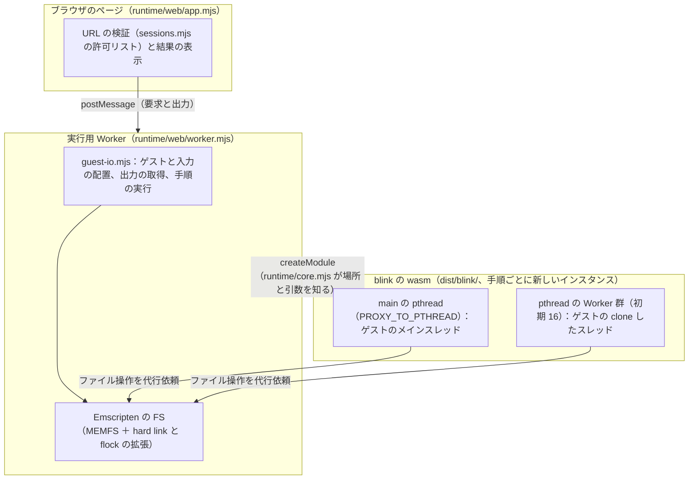

# アーキテクチャ（1 ページの要約）

formicarium は、改変していない x86-64 Linux のバイナリ（static-musl）を、カーネルを起動せずにブラウザと Node.js で動かす。
エミュレータのコアは jart/blink の fork を wasm にしたもの（インタプリタのみ）。詳しい経緯は [`OUTCOMES.md`](../OUTCOMES.md)、
不具合と修正の記録は [`results/failures.md`](results/failures.md) にある。2026-10-05 時点の内容。

## 全体の構成

テキストでの説明：ページは URL を許可リストで検証し、実行用 Worker に要求を送る。実行用 Worker は blink の wasm を読み込み、
仮想ファイルシステムにゲストと入力を置いてから実行する。blink はゲストのメインスレッドを pthread で動かし（`PROXY_TO_PTHREAD`）、
ゲストが `clone` したスレッドは pthread 用の Worker で動く。ファイルシステムは実行用 Worker の側にあり、
pthread からのファイル操作はそこへの代行依頼になる。Node.js では、ページと実行用 Worker の代わりに
`runtime/node/run.mjs`（CLI）と `worker_threads` の Worker（`runtime/node/worker.mjs`）が同じ役割を持つ。

## 層と依存の向き

| 層 | 場所 | 役割 | コアへの依存 |
|---|---|---|---|
| コアの記述子 | `runtime/core.mjs` | ビルド物の場所と、コアに渡すコマンドラインの組み立て | ここだけがコアを知る |
| 入出力の共通部 | `runtime/guest-io.mjs`、`runtime/session.mjs` | ゲストと入力の配置、stdout・stderr・終了コードの取得、手順の実行と書き起こし | なし（Emscripten の FS API だけ） |
| Node.js の実行環境 | `runtime/node/` | CLI、`worker_threads` の Worker | なし |
| ブラウザの実行環境 | `runtime/web/`、`scripts/serve.mjs` | ページ、実行用 Worker、許可リスト、COOP/COEP（サーバーか service worker） | なし |
| コア | `blink.lock` → `.vendor/blink` → `dist/blink/` | x86-64 の解釈実行と Linux のシステムコールのエミュレート | — |

コアは「wasm モジュール 1 つ＋起動用の JS（Emscripten の MODULARIZE 形式）」という境界でだけ扱う。将来、コアを
paludarium（Rust 版 blink）に置き換えるときは、`runtime/core.mjs` に記述子を足し、`dist/` にビルド物を置けばよい。

## コア（blink の fork）で足したもの

| 分野 | 実装 | 場所（fork） |
|---|---|---|
| スレッド | ゲストのスレッドを Emscripten の pthread（Web Worker）に対応づける | `817687f` |
| 待ちと通知 | `futex` の `FUTEX_WAIT_BITSET`／`WAKE_BITSET`、実時刻での期限判定 | `817687f`、`7e1d743` |
| ファイル記述子 | eventfd2、epoll（level／edge-triggered、`EPOLLONESHOT`）、socketpair、pipe をコアの中でエミュレート | `blink/emufd.c` |
| ファイルシステム | MEMFS に hard link と BSD 方式の flock を追加 | `blink/emscriptenfs.{c,js}` |
| メモリ | 非線形メモリでのページ管理表の排他、`madvise(MADV_DONTNEED)` でのゼロ化 | `7e1d743`、`4b5c67d` |
| ネットワーク | 使わない。`socket()` は `EAFNOSUPPORT` | `50bc466` |

## 実行の流れ（aube #1645 の場合）

1. ページが `?session=aube-1645` を許可リストと照合する。
2. 実行用 Worker が、手順書（`fixtures/sessions/aube-1645.txt`）、aube のバイナリ、入力のプロジェクトを取得する。
3. 手順ごとに、blink の新しいインスタンスを作って 1 コマンドを実行する。`rm -rf` は JS の側で行う。
4. 手順の間では、作業ディレクトリと HOME の中身を写し取り（`snapshotFs`）、次のインスタンスに置き直す（`populateFs`）。
5. 終わったら、native と同じ形式の書き起こしをページに返す。

## 主な設計判断（理由の詳細は OUTCOMES.md の 5 節）

- **インタプリタのみ**：JIT は後回し（[`results/jit-decision.md`](results/jit-decision.md)）。install の 9 割以上が解釈実行で、ネイティブの約 75 倍かかる。
- **手順ごとにインスタンスを作り直す**：実装を単純にするため。1 コマンドあたり 0.3〜0.5 秒の固定費がかかる。
- **ブラウザ版はネットワークなし**：native の基準値と条件をそろえ、余計な依存を増やさないため。
- **実行用 Worker で `Atomics.waitAsync` を無効にする**：WebKit で代行依頼の通知が取りこぼされ、ゲスト全体が止まったため。
- **wasm メモリの上限は 1 GB**：WebKit がインスタンスごとに上限まで確保し、ページの処理が終わるまで手放さないため。
- **ビルドはコンテナで行う**：Windows の emsdk では blink の `configure` と GNU make が動かないため。

## 制約

- 手順の間でファイルを引き継ぐとき、hard link は別々のファイルとして写る（1 回の実行の中では hard link として動く）。
- ゲストのメモリは 1 GB まで。
- `MADV_DONTNEED` は、ファイルをコピーしたプライベートなページではファイルの内容に戻らない。
- `PROXY_TO_PTHREAD` と SharedArrayBuffer を使うので、ブラウザでは `crossOriginIsolated`（COOP/COEP）が必要。
- 実機の Safari では確かめていない（WebKit で代用）。
